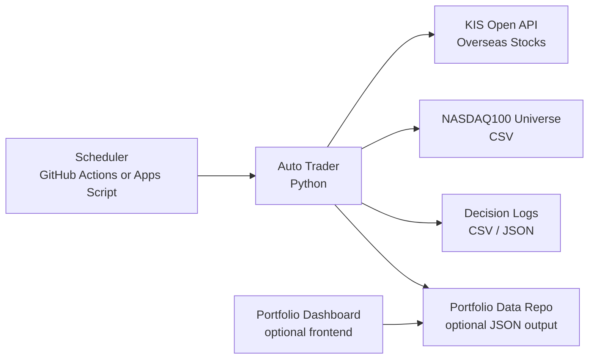
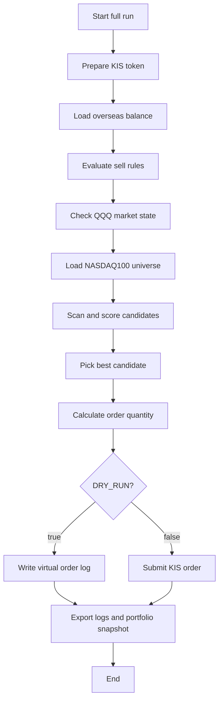

# System Architecture

This document describes the public template architecture without exposing private account data, credentials, tokens, or operating logs.

## Overview



The trading program is designed as a scheduled batch process. It does not require a server to run continuously.

## Main Components

| Component | Role |
| --- | --- |
| `auto_trader.py` | Main entry point and run-mode orchestration |
| `scanner.py` | Candidate filtering, scoring, market filter, sell decision logic |
| `kis_overseas.py` | KIS overseas stock API wrapper |
| `token_manager.py` | KIS access token caching |
| `universe.py` | Universe CSV loading and saving |
| `portfolio_exporter.py` | Portfolio snapshot and dashboard JSON export |
| `market_hours.py` | US regular-market time guard |
| `data/nasdaq100.csv` | Default stock universe |
| `.github/workflows/auto-trader.yml` | GitHub Actions automation example |

## Full Run Flow



## Market Filter

The strategy uses `QQQ` as a proxy for the NASDAQ100 market environment.

```text
strong: QQQ price > QQQ MA20 > QQQ MA60
normal: QQQ price > QQQ MA20
weak: QQQ price <= QQQ MA20
```

Sell decisions can still run in weak markets. The market filter mainly controls new buys.

## Data Outputs

The program can produce:

```text
logs/trading_log_*.csv
logs/trading_log_*.json
decision_log.json
portfolio.json
portfolio_dashboard.json
```

In the template, output push is optional. If you use a separate portfolio-data repository, keep it private unless you intentionally want to publish account snapshots.

## Security Boundary

Do not commit:

```text
.env
token_state.json
state.json
logs/
real account numbers
real API keys
GitHub personal access tokens
real order confirmations
portfolio snapshots with private balances
```

The public template intentionally starts with no Git history from a production repository.
